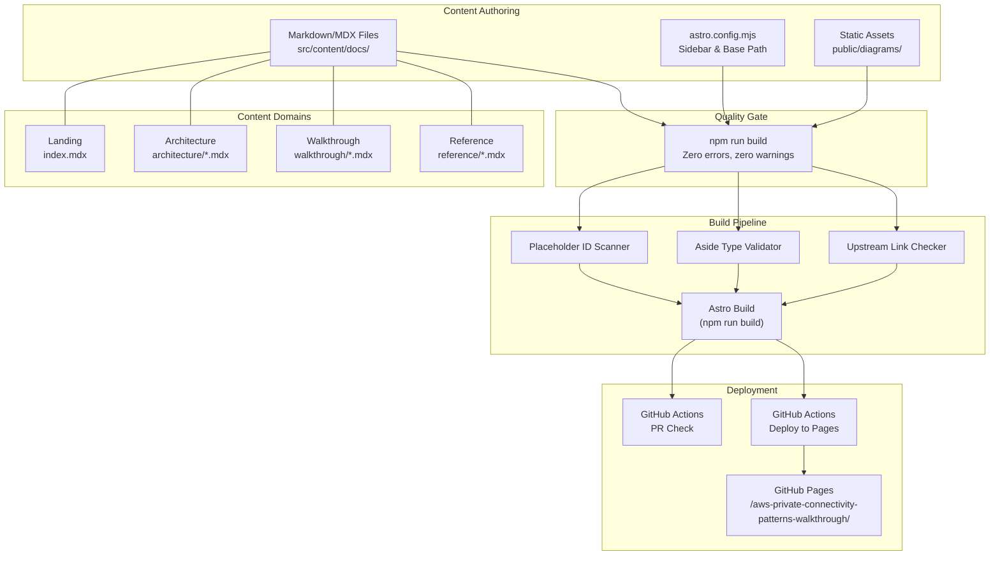

# Design Document

## Overview

This design describes a static documentation site built with Astro + Starlight that teaches platform engineers how to deploy and compare five independent AWS private cross-account connectivity patterns. The site serves as an operational walkthrough companion to the upstream Terraform demo repository (`jajera/aws-private-connectivity-patterns-demo`). No infrastructure-as-code exists in this repository; all Terraform lives upstream.

The site is deployed to GitHub Pages at `/aws-private-connectivity-patterns-walkthrough/`, uses Mermaid for topology diagrams, and enforces content quality through a `npm run build` quality gate enhanced with custom validation scripts for placeholder ID enforcement, aside standards compliance, and upstream link integrity.

## Architecture

### Architectural Decisions

| # | Decision | Choice | Rationale |
|---|----------|--------|-----------|
| AD-1 | Static site generator | Astro + Starlight | Purpose-built documentation theme with sidebar navigation, search, dark mode, and MDX support out of the box. Eliminates custom UI work. |
| AD-2 | Deployment target | GitHub Pages | Zero-cost hosting tightly integrated with the GitHub Actions CI/CD pipeline already used by the upstream demo repo. |
| AD-3 | Diagram rendering | Mermaid (inline code blocks) | Version-controllable, diff-friendly diagrams rendered client-side. No external tooling or image export pipeline required. |
| AD-4 | Placeholder ID enforcement | Custom build-time linting script | Prevents accidental publication of real AWS account IDs, ARNs, or DNS hostnames. Integrated into `npm run build` as a pre-build validation step. |
| AD-5 | Aside type restriction | Custom build-time linting script | Restricts callouts to `tip`, `caution`, and `danger` only, rejecting `note` or other types. Ensures consistent reader experience. |
| AD-6 | Content domain structure | Four top-level directories under `src/content/docs/` | Landing (root index), Architecture, Walkthrough, and Reference map directly to sidebar navigation groups. |
| AD-7 | Upstream link pinning | Source_Version_Declaration on landing page | All links to the upstream demo repo use a pinned commit/tag, ensuring documentation and code stay synchronized. |
| AD-8 | Base path configuration | `/aws-private-connectivity-patterns-walkthrough/` | Required for GitHub Pages project-site deployment under the repository name. |
| AD-9 | CI/CD pipeline | GitHub Actions with required status check | Pull requests run the quality gate; pushes to `main` trigger deployment. No manual intervention needed. |
| AD-10 | Static images from upstream | Copied into `public/diagrams/` | Official AWS icon diagrams from the upstream `docs/diagrams/` directory are included as static assets alongside Mermaid representations. |
| AD-11 | Cloud WAN RAM region framing | Document `us-east-1` as required because the core network is a global RAM resource | Avoid implying workloads run in `us-east-1`. AWS RAM shares of global resources (including Cloud WAN core networks) must be created and accepted in `us-east-1` so all regions can see the share; workload VPCs remain in Cloud_WAN_Regions. |

### Site Architecture Diagram



## Components and Interfaces

### 1. Content Layer

The content layer comprises Markdown/MDX files organized by content domain:

| Component | Path | Purpose |
|-----------|------|---------|
| Landing page | `src/content/docs/index.mdx` | Site entry point with purpose, audience, comparison table, Source_Version_Declaration |
| Architecture pages | `src/content/docs/architecture/*.mdx` | Account topology, pattern comparison, per-pattern diagrams, Cloud WAN segments, and global core-network RAM sharing in `us-east-1` |
| Walkthrough pages | `src/content/docs/walkthrough/*.mdx` | Prerequisites, execution model, per-pattern steps, verification, teardown, troubleshooting |
| Reference pages | `src/content/docs/reference/*.mdx` | FAQ, ADRs, glossary, AWS doc links, sensitive data guidance |

### 2. Configuration Layer

| Component | Path | Purpose |
|-----------|------|---------|
| Astro config | `astro.config.mjs` | Site metadata, base path, Starlight sidebar groups, Mermaid integration |
| Package manifest | `package.json` | Dependencies, build scripts, quality gate command |
| TypeScript config | `tsconfig.json` | Astro TypeScript settings |

### 3. Validation Layer (Quality Gate Scripts)

| Component | Path | Purpose |
|-----------|------|---------|
| Placeholder ID scanner | `scripts/check-placeholders.mjs` | Scans fenced code blocks for prohibited 12-digit numbers, non-allowlisted ARNs, and AWS DNS patterns |
| Aside type validator | `scripts/check-asides.mjs` | Scans MDX/MD files for aside types other than `tip`, `caution`, `danger` |
| Upstream link checker | `scripts/check-links.mjs` | Validates that all upstream repo links use the pinned Source_Version_Declaration and resolve correctly |
| Build orchestrator | `package.json` `build` script | Runs validators then `astro build` |

### 4. CI/CD Layer

| Component | Path | Purpose |
|-----------|------|---------|
| PR validation workflow | `.github/workflows/ci.yml` | Runs `npm run build` on pull requests; reports status check |
| Deploy workflow | `.github/workflows/deploy.yml` | On push to `main`, builds and deploys to GitHub Pages |

### 5. Static Assets

| Component | Path | Purpose |
|-----------|------|---------|
| Upstream diagrams | `public/diagrams/` | Official AWS icon diagrams from upstream `docs/diagrams/` directory |

## Data Models

### Source Version Declaration

```typescript
interface SourceVersionDeclaration {
  repository: "jajera/aws-private-connectivity-patterns-demo";
  ref: string; // commit SHA or tag name
  url: string; // full GitHub tree URL at pinned ref
}
```

### Placeholder ID Allow-List

```typescript
interface PlaceholderConfig {
  allowedAccountIds: ["123456789012", "987654321098"];
  allowedArnPattern: RegExp; // arn:aws:*:*:{allowedAccountId}:*EXAMPLE*
  allowedDnsPatterns: string[]; // documented placeholder hostnames
  scanScope: "fenced-code-blocks" | "command-examples" | "output-samples";
}
```

### Pattern Metadata

```typescript
interface PatternMetadata {
  name: "vpc-peering" | "privatelink" | "lattice" | "tgw" | "cloudwan";
  displayName: string;
  osiLayer: "L3" | "L4" | "L7";
  cidrOverlap: boolean;
  costDriver: string;
  useCase: string;
  complexity: "low" | "medium" | "high";
  regions: string[]; // workload regions; for cloudwan: Cloud_WAN_Regions
  ramRegion?: "us-east-1"; // set for cloudwan only — global core network share via RAM
  upstreamPath: string; // e.g., "terraform/patterns/privatelink/"
  roles: ["shared-services", "consumer"];
}
```

Cloud WAN is the only pattern that sets `ramRegion`. The core network is a global resource; AWS RAM therefore requires the share to be created and accepted in `us-east-1` even though attachments and VPCs live in `regions` (`ap-southeast-2`, `ap-southeast-6`, `ap-southeast-1`).

### Aside Validation Rule

```typescript
interface AsideRule {
  allowedTypes: ["tip", "caution", "danger"];
  syntaxPattern: RegExp; // /^:::(tip|caution|danger|note|warning)/
  violationMessage: (file: string, line: number, type: string) => string;
}
```

## Upstream Content Mapping

This table maps files from the upstream demo repository to pages in the documentation site:

| Upstream Source | Site Page | Content Domain | Purpose |
|----------------|-----------|----------------|---------|
| `README.md` | `index.mdx` | Landing | Pattern overview, quick-start summary adapted into purpose and comparison table |
| `docs/architecture.md` | `architecture/topology.mdx` | Architecture | Account topology, profiles, region descriptions; RAM_Region (`us-east-1`) labeled as global core-network share region, not a workload region |
| `docs/architecture.md` | `architecture/comparison.mdx` | Architecture | Pattern comparison table (OSI layer, CIDR overlap, cost, use case) |
| `docs/architecture.md` | `reference/adrs.mdx` | Reference | ADR entries extracted and presented with context/decision/consequences |
| `docs/diagrams/*.svg` | `public/diagrams/` + per-pattern pages | Architecture | Official AWS icon diagrams as static images |
| `docs/walkthrough.md` | `walkthrough/privatelink.mdx` | Walkthrough | PrivateLink apply steps, outputs, verification |
| `docs/walkthrough.md` | `walkthrough/lattice.mdx` | Walkthrough | Lattice apply steps, RAM acceptance, verification |
| `docs/walkthrough.md` | `walkthrough/vpc-peering.mdx` | Walkthrough | VPC Peering apply, acceptance, DNS resolution |
| `docs/walkthrough.md` | `walkthrough/tgw.mdx` | Walkthrough | TGW apply, attachment acceptance, route config |
| `docs/walkthrough.md` | `walkthrough/cloudwan.mdx` | Walkthrough | Cloud WAN multi-region apply, global core-network RAM share acceptance in `us-east-1`, segment verification |
| `terraform/patterns/*/` | Upstream links on walkthrough pages | Walkthrough | Hyperlinks to pinned Terraform directories (not copied) |
| `local.env.example` (if exists) | `reference/sensitive-data.mdx` | Reference | Sensitive data guidance, `.gitignore` patterns |

## Cloud WAN Segments and RAM Content Design

Requirement 5 content lives primarily on `architecture/diagram-cloudwan.mdx`, with operational follow-through on `walkthrough/cloudwan.mdx`. Content authors MUST frame the RAM region as a consequence of the core network being global, not as a workload placement choice.

| Content element | Page | Design intent |
|-----------------|------|---------------|
| Three segments (shared, workloads, sandbox) and inter-segment routing | `architecture/diagram-cloudwan.mdx` | shared ↔ workloads allow mutual traffic; sandbox is isolated |
| Global core network + RAM in `us-east-1` | `architecture/diagram-cloudwan.mdx` | Explain that the Cloud WAN core network is a global resource shared via RAM; AWS RAM requires global resource shares to be created and accepted in RAM_Region (`us-east-1`) regardless of Cloud_WAN_Regions |
| Multi-region topology | `architecture/diagram-cloudwan.mdx` | Map segments and roles across `ap-southeast-2`, `ap-southeast-6`, `ap-southeast-1` |
| Mermaid: segments ↔ regions + RAM flow | `architecture/diagram-cloudwan.mdx` | Show all three segments, all three Cloud_WAN_Regions, and the RAM share of the global core network originating from `us-east-1` |
| Tip aside | `architecture/diagram-cloudwan.mdx` | State that RAM sharing uses `us-east-1` because the core network is global — not because workloads run there |
| Apply order, RAM acceptance, segment verification | `walkthrough/cloudwan.mdx` | Accept the global core-network share from RAM_Region (`us-east-1`); verify shared ↔ workloads allow and sandbox deny |

Topology diagrams that mention RAM_Region (including `architecture/topology.mdx`) SHOULD use the same causal framing so readers do not infer that Cloud WAN workloads are deployed in `us-east-1`.

## Page Inventory

### Landing Content Domain

| # | Page Title | File Path | Requirements |
|---|-----------|-----------|--------------|
| 1 | Home / Landing | `src/content/docs/index.mdx` | 1.1, 1.2, 1.3, 1.4, 1.5 |

### Architecture Content Domain

| # | Page Title | File Path | Requirements |
|---|-----------|-----------|--------------|
| 2 | Account Topology | `src/content/docs/architecture/topology.mdx` | 2.1, 2.2, 2.3, 2.4 |
| 3 | Pattern Comparison | `src/content/docs/architecture/comparison.mdx` | 3.1, 3.2, 3.3 |
| 4 | VPC Peering Diagram | `src/content/docs/architecture/diagram-vpc-peering.mdx` | 4.1, 4.2, 4.3, 4.4, 24.1, 24.2, 24.3, 24.4 |
| 5 | PrivateLink Diagram | `src/content/docs/architecture/diagram-privatelink.mdx` | 4.1, 4.2, 4.3, 4.4, 24.1, 24.2, 24.3, 24.4 |
| 6 | Lattice Diagram | `src/content/docs/architecture/diagram-lattice.mdx` | 4.1, 4.2, 4.3, 4.4, 24.1, 24.2, 24.3, 24.4 |
| 7 | TGW Diagram | `src/content/docs/architecture/diagram-tgw.mdx` | 4.1, 4.2, 4.3, 4.4, 24.1, 24.2, 24.3, 24.4 |
| 8 | Cloud WAN Diagram (segments, global core network, RAM) | `src/content/docs/architecture/diagram-cloudwan.mdx` | 4.1, 4.2, 4.3, 4.4, 5.1, 5.2, 5.3, 5.4, 5.5, 24.1, 24.2, 24.3, 24.4 |

### Walkthrough Content Domain

| # | Page Title | File Path | Requirements |
|---|-----------|-----------|--------------|
| 9 | Prerequisites & Preflight | `src/content/docs/walkthrough/prerequisites.mdx` | 6.1, 6.2, 6.3, 6.4 |
| 10 | Pattern Execution Model | `src/content/docs/walkthrough/execution-model.mdx` | 7.1, 7.2, 7.3, 7.4 |
| 11 | PrivateLink Walkthrough | `src/content/docs/walkthrough/privatelink.mdx` | 8.1, 8.2, 8.3, 8.4, 8.5, 25.1, 25.2, 25.3 |
| 12 | Lattice Walkthrough | `src/content/docs/walkthrough/lattice.mdx` | 9.1, 9.2, 9.3, 9.4, 25.1, 25.2, 25.3 |
| 13 | VPC Peering Walkthrough | `src/content/docs/walkthrough/vpc-peering.mdx` | 10.1, 10.2, 10.3, 10.4, 25.1, 25.2, 25.3 |
| 14 | TGW Walkthrough | `src/content/docs/walkthrough/tgw.mdx` | 11.1, 11.2, 11.3, 11.4, 25.1, 25.2, 25.3 |
| 15 | Cloud WAN Walkthrough (multi-region + global RAM share) | `src/content/docs/walkthrough/cloudwan.mdx` | 12.1, 12.2, 12.3, 12.4, 12.5, 25.1, 25.2, 25.3 |
| 16 | Verification | `src/content/docs/walkthrough/verification.mdx` | 13.1, 13.2, 13.3, 13.4, 13.5 |
| 17 | Teardown | `src/content/docs/walkthrough/teardown.mdx` | 14.1, 14.2, 14.3, 14.4, 14.5 |
| 18 | Troubleshooting | `src/content/docs/walkthrough/troubleshooting.mdx` | 15.1, 15.2, 15.3 |

### Reference Content Domain

| # | Page Title | File Path | Requirements |
|---|-----------|-----------|--------------|
| 19 | FAQ | `src/content/docs/reference/faq.mdx` | 16.1, 16.2, 16.3 |
| 20 | Decision Log & ADRs | `src/content/docs/reference/adrs.mdx` | 17.1, 17.2, 17.3, 17.4 |
| 21 | Glossary | `src/content/docs/reference/glossary.mdx` | 18.1, 18.2, 18.3, 18.4 |
| 22 | AWS Documentation Links | `src/content/docs/reference/links.mdx` | 19.1, 19.2, 19.3, 19.4 |
| 23 | Sensitive Data & local.env | `src/content/docs/reference/sensitive-data.mdx` | 20.1, 20.2, 20.3, 20.4 |

### Cross-Cutting (Non-Page) Components

| # | Component | File Path | Requirements |
|---|-----------|-----------|--------------|
| 24 | CI/CD — PR check | `.github/workflows/ci.yml` | 21.2, 21.4, 21.5 |
| 25 | CI/CD — Deploy | `.github/workflows/deploy.yml` | 21.1, 21.3 |
| 26 | Placeholder ID scanner | `scripts/check-placeholders.mjs` | 22.1, 22.2, 22.3, 22.4 |
| 27 | Aside type validator | `scripts/check-asides.mjs` | 23.4, 23.5 |
| 28 | Upstream link checker | `scripts/check-links.mjs` | 1.5, 19.4, 25.2, 27.4 |
| 29 | Astro configuration | `astro.config.mjs` | 21.1, 26.2, 26.3, 26.4 |
| 30 | Build script | `package.json` (build command) | 21.2, 27.1 |


## Correctness Properties

*A property is a characteristic or behavior that should hold true across all valid executions of a system — essentially, a formal statement about what the system should do. Properties serve as the bridge between human-readable specifications and machine-verifiable correctness guarantees.*

### Property 1: Placeholder Scanner Detection Correctness

*For any* Markdown/MDX content containing fenced code blocks, the placeholder scanner SHALL flag every 12-digit numeric sequence not in the approved allow-list (`123456789012`, `987654321098`) and every ARN containing a non-allowlisted account ID, while ignoring 12-digit numbers that appear outside fenced code blocks, command examples, and output samples.

**Validates: Requirements 22.1, 22.2, 22.4**

### Property 2: Placeholder Scanner Error Reporting

*For any* violation detected by the placeholder scanner, the error output SHALL contain the violating file path, the line number where the violation occurs, and the matched pattern string.

**Validates: Requirements 22.3**

### Property 3: Upstream Link Format Pinning

*For any* pattern name in `{vpc-peering, privatelink, lattice, tgw, cloudwan}` and any role in `{shared-services, consumer}`, the generated upstream link SHALL match the format `https://github.com/jajera/aws-private-connectivity-patterns-demo/tree/<pinned-ref>/terraform/patterns/<pattern-name>/<role>/` where `<pinned-ref>` equals the Source_Version_Declaration value.

**Validates: Requirements 8.2, 9.2, 10.2, 11.2, 12.2, 17.3, 25.1, 25.2**

### Property 4: Aside Type Validation

*For any* Markdown/MDX file containing an aside directive (lines matching `:::` syntax), the aside validator SHALL accept types `tip`, `caution`, and `danger`, and SHALL reject all other type strings (including `note`, `warning`, `info`) with an error message identifying the file path and disallowed type.

**Validates: Requirements 23.4, 23.5**

### Property 5: Mermaid Diagram Standards Compliance

*For any* Mermaid code block in the site, the diagram SHALL use top-down (`TD`) graph direction, SHALL include a legend (subgraph or comment block identifying node type shapes), and SHALL use a consistent shape-to-type mapping where each node type uses the same Mermaid shape across all diagrams.

**Validates: Requirements 24.1, 24.2, 24.4**

### Property 6: Heading Hierarchy Validity

*For any* HTML page produced by the Astro build, heading elements SHALL follow semantic hierarchy with no skipped levels (an `h2` is never followed by an `h4` without an intervening `h3`).

**Validates: Requirements 27.2**

### Property 7: Image Alt Text Minimum Length

*For any* `` element in the rendered site output that references a static diagram, the `alt` attribute SHALL be present and contain at least 20 characters.

**Validates: Requirements 27.3**

### Property 8: Glossary Entry Validity

*For any* set of glossary entries rendered on the glossary page, entries SHALL appear in case-insensitive alphabetical order by term name, and each entry's definition SHALL contain no more than 150 words.

**Validates: Requirements 18.2, 18.3**

## Error Handling

| Error Condition | Detection Point | Behavior | User Feedback |
|----------------|-----------------|----------|---------------|
| Real AWS account ID in code block | `scripts/check-placeholders.mjs` (build time) | Build fails, exit code 1 | Error message: file path, line number, matched 12-digit pattern |
| Non-allowlisted ARN in code block | `scripts/check-placeholders.mjs` (build time) | Build fails, exit code 1 | Error message: file path, line number, matched ARN string |
| Disallowed aside type (e.g., `:::note`) | `scripts/check-asides.mjs` (build time) | Build fails, exit code 1 | Error message: file path, line number, disallowed type name |
| Upstream link uses wrong ref | `scripts/check-links.mjs` (build time) | Build fails, exit code 1 | Error message: expected ref from Source_Version_Declaration, found different ref |
| Upstream link returns non-200 | `scripts/check-links.mjs` (build time) | Build fails, exit code 1 | Error message: URL and HTTP status or connection error |
| AWS docs link broken | `scripts/check-links.mjs` (build time) | Build fails, exit code 1 | Error message: broken URL and expected target |
| Invalid Source_Version_Declaration | `scripts/check-links.mjs` (build time) | Build fails, exit code 1 | Error message: ref does not exist in upstream repo |
| Astro build error (syntax, config) | `astro build` (build time) | Build fails, exit code 1 | Astro compiler error with file and line info |
| Skipped heading level | `astro build` (build time) | Build warning or error | Starlight warns about heading hierarchy violations |
| Missing alt text on image | `astro build` (build time) | Build warning | Astro/accessibility lint identifies missing alt |
| GitHub Pages deploy failure | `.github/workflows/deploy.yml` (deploy time) | Workflow fails | GitHub Actions log shows deployment error |

### Error Handling Strategy

1. **Fail-fast in CI**: All validation scripts run before `astro build`. If any script exits non-zero, the build aborts immediately without proceeding to compilation.
2. **Actionable messages**: Every error includes the file path and line number so contributors can fix issues without searching.
3. **No silent failures**: The quality gate treats warnings as errors for critical validators (placeholders, asides, links).
4. **Graceful degradation for optional content**: If the upstream repo lacks a diagram for a pattern (`docs/diagrams/`), the page renders with only the Mermaid diagram — no broken image placeholder.

## Testing Strategy

### Unit Tests (Example-Based)

Unit tests verify specific content presence, structure, and configuration:

| Test Area | What is Verified | Approach |
|-----------|-----------------|----------|
| Page existence | All 23 content pages exist at expected paths | File-system assertion |
| Landing page structure | Sections appear in required order | DOM/content assertion on rendered output |
| Comparison table | 5 rows, correct columns | Parse table from rendered page |
| Sidebar configuration | Four domain groups with correct page order | Parse `astro.config.mjs` |
| Base path | Set to `/aws-private-connectivity-patterns-walkthrough/` | Assert config value |
| Aside content mapping | `tip` = suggestions, `caution` = attention, `danger` = cost/security | Spot-check per page |
| Cloud WAN RAM tip | Tip states `us-east-1` is required because the core network is a global resource, not because workloads run there | Assert tip text on `diagram-cloudwan.mdx` |
| Troubleshooting structure | Each entry has: pattern, symptom, cause, resolution, verification | Parse each subsection |
| FAQ minimum count | At least 5 Q&A pairs covering required topics | Count entries |
| ADR structure | Each entry has context, decision, consequences | Parse labeled sections |
| Glossary completeness | All required terms defined | Check term list |

### Property-Based Tests

Property-based tests verify universal invariants using generated inputs. Each test runs a minimum of 100 iterations.

| Property | Test Library | Generator Strategy |
|----------|-------------|-------------------|
| Property 1: Placeholder Scanner Detection | fast-check | Generate random markdown with code blocks containing: (a) allowlisted IDs, (b) random 12-digit numbers, (c) IDs in prose outside blocks |
| Property 2: Placeholder Scanner Reporting | fast-check | Generate files with known violations at random positions; verify output format |
| Property 3: Upstream Link Format | fast-check | Generate from the enum of pattern names × roles × random ref strings |
| Property 4: Aside Type Validation | fast-check | Generate markdown files with random `:::` directives using both valid and invalid type strings |
| Property 5: Mermaid Diagram Standards | fast-check | Extract all Mermaid blocks from built site; verify TD direction, legend, and shape consistency |
| Property 6: Heading Hierarchy | fast-check | Generate random heading sequences; verify the hierarchy checker correctly identifies skips |
| Property 7: Image Alt Text | fast-check | Generate `` elements with random alt text lengths; verify threshold enforcement |
| Property 8: Glossary Entry Validity | fast-check | Generate random term lists and definitions; verify sort order and word count constraint |

**Configuration:**
- Library: `fast-check` (JavaScript/TypeScript property-based testing)
- Minimum iterations: 100 per property
- Tag format: `Feature: aws-private-connectivity-patterns-walkthrough, Property {N}: {title}`

### Integration Tests

| Test Area | What is Verified | Approach |
|-----------|-----------------|----------|
| Full build | `npm run build` exits 0 | Run build in CI |
| GitHub Pages deployment | Site accessible at base path | Post-deploy smoke test |
| Upstream link resolution | All upstream links return HTTP 200 | Network request per link (CI only) |
| AWS docs link resolution | All `docs.aws.amazon.com` links return HTTP 200 | Network request per link (CI only) |

### Test Execution

```bash
# Unit + property tests
npm test

# Full quality gate (validators + build)
npm run build

# Integration tests (requires network)
npm run test:integration
```
